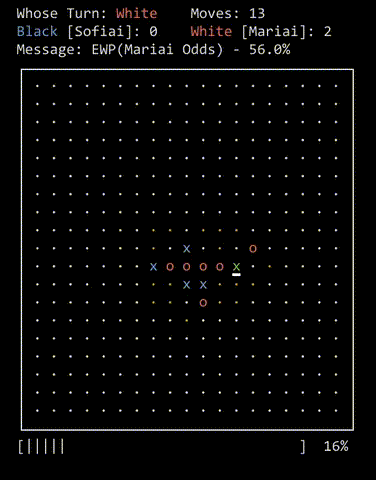

BCF Game and its AI gaming
===

## What

BCF stands for **B**itten **C**onnect-**F**ive and I created this game — in fact, just a variation on a East-Asian board game, "Gomoku" or "Five-in-a-row" — to make [Gomoku](https://en.wikipedia.org/wiki/Gomoku) a more complex rule. (In reality, sometimes Gomoku make us feel a little boring compared to its complexity of the game tree.) I just wanted a game that people could learn and enjoy time easily but not spending much time like [Go](https://en.wikipedia.org/wiki/Go_(game)).

I named it BCF, but it is actually closer to [Gomoku](https://en.wikipedia.org/wiki/Gomoku) rather than [Connect Five](https://en.wikipedia.org/wiki/Connect_Four). I just added some basic rules into the Gomoku so that I made it more complicated.

## Rule

In [Gomoku](https://en.wikipedia.org/wiki/Gomoku), a player win who firstly makes five stones in a row in any direction. (not broken chain of five stones in horizontal, vertical, or diagonal direction) In addition to this, I defined two simple basic rules below:

* If your last move can clamp your opponent's *two successive* stones, you can capture them. Multi-directional capturing is possible with a move so theretically, up to 16 captures are possible with only a move.

* 10 points (10 captured stones) are equivalent to "the five stone in a row", meaning firstly winning 10 points is a victory. 

## BCF AIs: Sofiai and Mariai

I implemented two game AIs for BCF, called **Sofiai** and **Mariai**. Very weird name, but it originated from my two daughters, Sofia and Maria. (Sofiai = Sofia + AI, and Mariai = Maria + AI. Blame my naming skills :$)

For now, my second princess Maria is much, much stronger, but that does not mean I love her more. ;-)

[Minimax algorithm](https://en.wikipedia.org/wiki/Minimax) was used in **Sofiai** and [MTCS (Monte-Carlo Tree Search)](https://en.wikipedia.org/wiki/Monte_Carlo_tree_search) and [UCT(Upper Confidence Bound applied to trees)](https://www.chessprogramming.org/UCT) method was used in **Mariai**. By default, Sofiai tries to search only 4-depth (4 piles) and that's why Sofiai is quite fast and responsive, coping well with near futures, but not looking ahead well compared to Mariai.

All the configurable parameters are defined `common.h` such as UCB constants, self-playout number and node expansion threshold when searching tress at "expansion stage (refer to `common.h`)

You can even change the given *board size (default: 19x19)*, *winning point (default: 10)*, and *BCF mode (default: 1)*. Those are because I was very curious how much it would affect the winning probabilities among the AIs from each different algorithm. 

Turning on "*BCF mode*" means literally to use the definition of BCF gaming rule. If you turn off the flag, you can enjoy game with the original rule, Gomoku!

When entering the game, one can access each gaming mode with shortcuts (`1`,` 2`, .. and `q`) as shown below.

## Todo

When playing with Mariai, long ponding time due to 1-million playouts is a little bit annoying (moreover, I did not introduce any parallel MCTS). One of big problems when searching BCF game tress is the huge *branching factor(b)* of `~20` and *average game length(d)* of `30~40`. Roughly, the game-tree complexity of `20^30 to 20^40 = 1e39 to 1e52` is gigantic indeed and it is comparable to Chess. (*Chess* is known as ~`1e47` and *Go* is `~1e170`)

**Mariai** seems to be beyond competent humans players, but guessing next move well and estimating the current state or score better are still challenging. So I decided to introduce neural networks here. I am not going to use the supervised training method because, as you know, there's no history or good game logs related to this game. Rather, now I am working on the reinforce training to do this. 

It would be the first BCF engine with no human-provided knowledge like AlphaGo-zero and Leela-zero. 
It also would be fun and great if we can compare moves from the *BCF-zero AI* with moves from Mariai.

## Demo

Click to the images below to watch the games among the AIs and proficient players :-$

#### Sofiai (minimax algorithm) vs Mariai (MCTS, 1million play-outs)

* 1st game (Mariai won)

  

* 2nd game (Mariai won)

  

* 3rd game (Mariai won)

  

* 4th game (Mariai won)

  

* 5th game (Maria won)

  

#### Human(Francis Lim, Go Amateur 5d) vs Mariai (MCTS, 1million play-outs)

* 1st game (Mariai won)

  

* 2nd game (Mariai won)

  

* 3rd game (Mariai won)

  